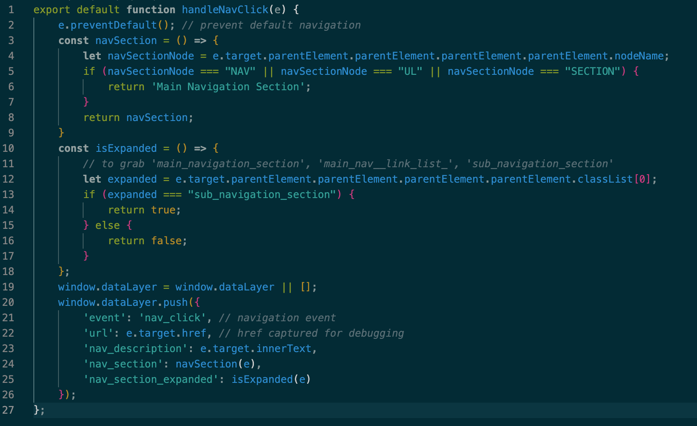
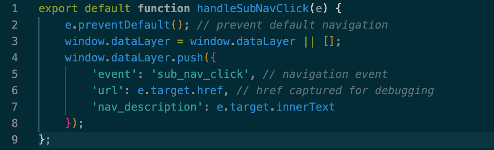
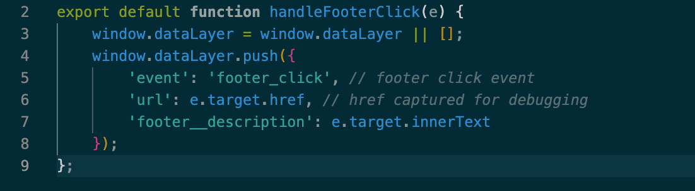
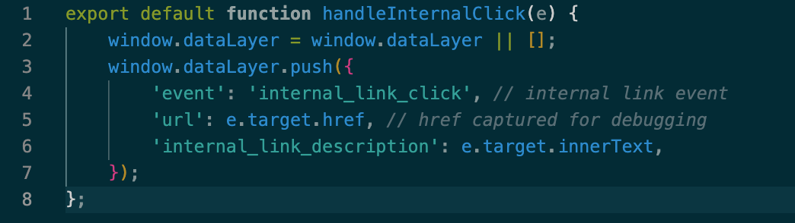
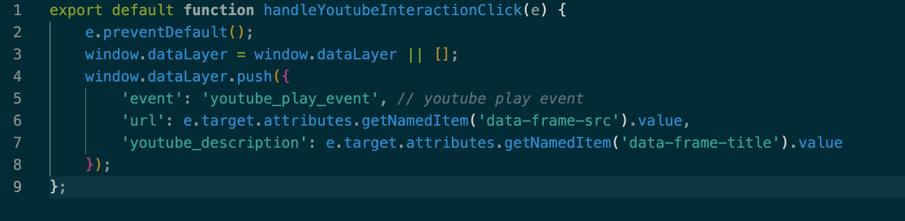

# Ableton-Aboutpage-Clone
A front-end project to recreate the Ableton website using React and Vite. This project focuses on mastering typography, spacing, grid layouts, and multi-column footers while incorporating event listener functionality for Google Tag Manager (GTM) and GA4 tracking, along with AB Tasty for A/B testing.

## 🛠️ Technologies Used

- React for UI components

- Vite for fast build and development

- Styled Components/CSS Modules for styling

- Google Tag Manager (GTM) with dataLayer.push for event tracking

- AB Tasty for A/B testing integrations (In Progress)

## 🔑 Key Features

### UI/UX

- Custom Typography inspired by the Ableton website

- Consistent Spacing and padding for responsive design

- Unique Grid Layout for page sections

- Multi-column Footer with accessible links

### Tracking & Analytics

- Event Listeners for SPA navigation and user interaction tracking
    - #### Event Handlers: In React, an "event handler" is a function that is triggered when a specific user interaction (i.e. navigation or form submission) occurs on a component. This allows you to respond to these events by updating the component's state or performing other actions, and can be used to push data to the dataLayer (a common practice for tracking user behavior with analytics tools such as GA4->GTM for this demo) by executing code within the event handler function that pushes the relevant data to the dataLayer when the event is triggered. 
    - #### As best practice, using the [dataLayer method](https://developers.google.com/tag-platform/tag-manager/datalayer) for analytics purposes in React applications is recommended for flexibility and scalability, but most importantly SPA support. The dataLayer allows for the tracking of a wide range of events and parameters beyond basic page views. This flexibility is crucial for capturing detailed user behavior and custom events specific to the application. In SPAs, traditional page view tracking methods may not accurately capture user navigation. The dataLayer enables the tracking of virtual page views and route changes, providing a more accurate representation of user journeys.


- dataLayer.push for custom events (GTM -> GA4 integration) | A great tool to use to inspect the React component hierarchies in the Chrome Developer Tools is [React Developer Tools](https://chromewebstore.google.com/detail/react-developer-tools/fmkadmapgofadopljbjfkapdkoienihi?hl=en), specifically the case to see how events are being handled.

    - #### Navigation click events (handleNavClick.js)
    
    
    - #### Sub Navigation click events (handleSubNavClick.js)
    

    - #### Footer click events (handleFooterClick.js)
    

    - #### Internal link click events (handleInternalClick.js)
    

    - #### Youtube interaction click events (handleYoutubeInteractionClick.js)
    

    - #### Language and Location (In Progress)
    - #### Consent State demos (In Progress)

- Sample setup for AB Tasty tests
    - #### AB Tasty Test Setup based on synchronous loading to avoid any UX disruptions (i.e. flickering). AB Tasty is one of the top digital experience optimization platforms that helps businesses test, personalize, and optimize their websites and applications to improve user engagement, conversions, and overall customer experience. 
- Sandbox setup for CookieBot (In Progress)
- Newsletter signup (In progress)

## Setup Instructions: Create Your Own Clone

Follow these steps to set up your own version of this SPA project:

1. Ensure Git is Installed
   - Download and install Git from [git-scm.com](https://git-scm.com/downloads)
   - Verify installation by running: 
   ```terminal
   git --version
   ```

2. Create a New [Vite + React](https://vite.dev/guide/) Project (If starting fresh)
    ```terminal
    npm create vite@latest ableton-clone --template react
    cd ableton-clone
    npm install
    ```

3. Clone This Repository (If using this as a base)
    ```terminal
    git clone https://github.com/your-username/Ableton-Aboutpage-Clone.git
    cd Ableton-Aboutpage-Clone
    npm install
    ```

4. Update Google Tag Manager (GTM) Container ID
    - Replace the existing GTM-XXXXXXX with your own GTM container ID

5. Start the Development Server
    ```terminal
    npm run dev
    ```
    - This will start the app locally on http://localhost:5173/

6. Deploy to GitHub Pages (Optional)
    - Once everything all checks out, update the homepage field in package.json:
    ```json
    "homepage": "https://your-username.github.io/Ableton-Aboutpage-Clone"
    ```
    - Install GitHub Pages package:
    ```terminal
    npm install gh-pages --save-dev
    ```
    - Add deployment scripts to package.json:
    ```json
    "scripts": {
    "predeploy": "npm run build",
    "deploy": "gh-pages -d dist"
    }
    ```
    - Deploy with:
    ```terminal
    npm run deploy
    ```
7. Verify Tracking Setup
    - Open GTM Preview mode or check your live site to ensure dataLayer events fire correctly.

## 📝 License

This project is for educational purposes only.